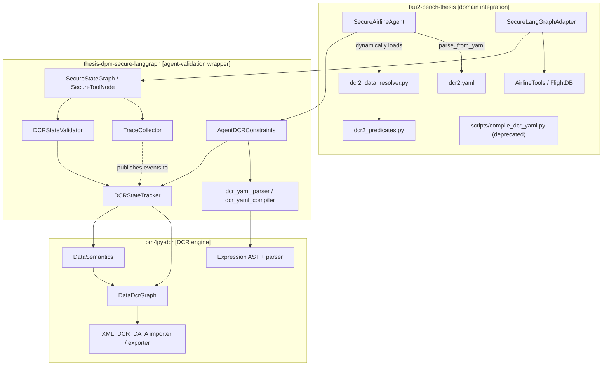
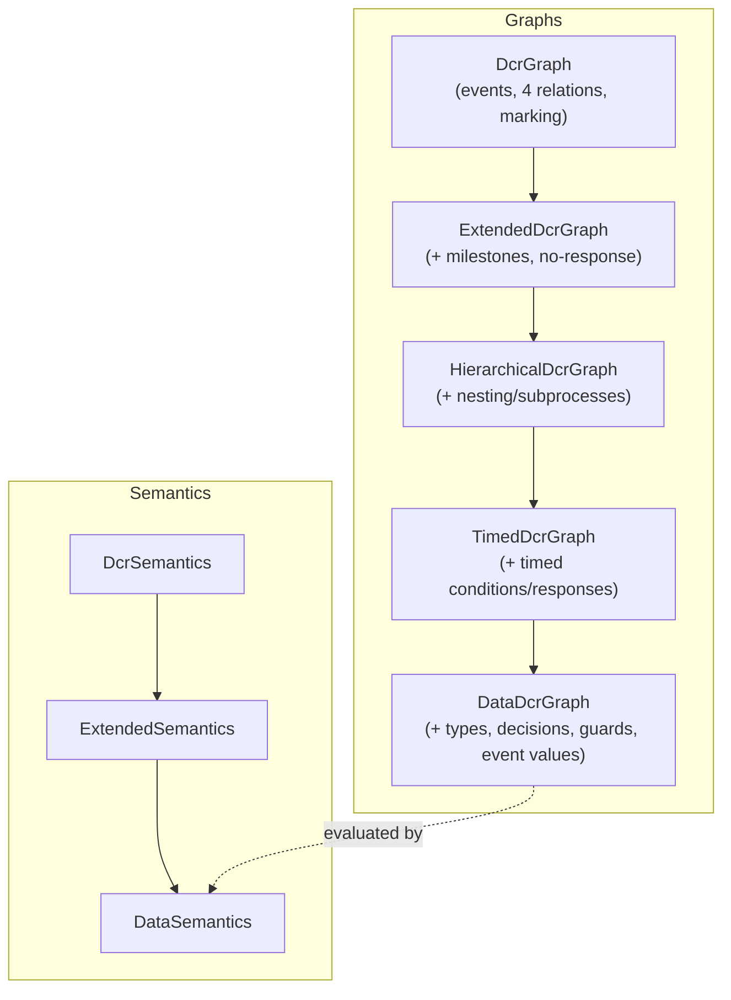
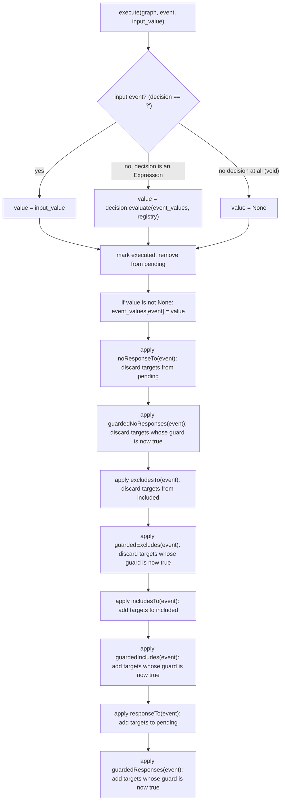
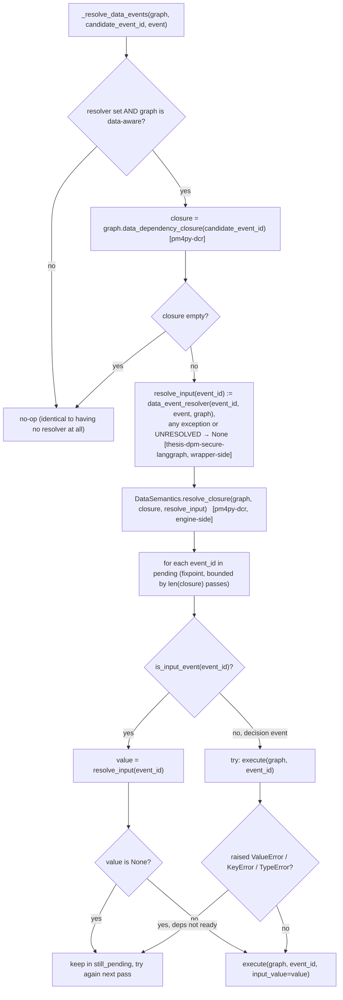
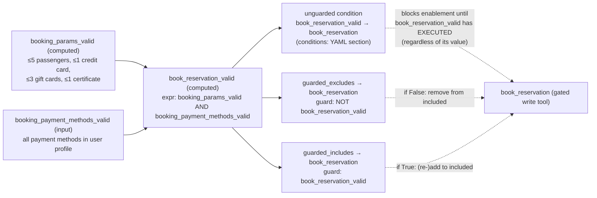

# Data-Aware DCR Evaluation Architecture

This document explains, end to end, how a data-aware DCR (Dynamic Condition
Response) policy is defined, compiled, loaded, and evaluated against a live
LLM agent's tool calls in this project — including the predicate/resolver
mechanism that supplies real-world values into the graph.

The system spans **three repositories**, each with a distinct
responsibility:

| Repo | Role | Tag used below |
|---|---|---|
| [`pm4py-dcr`](/home/silas/projects/pm4py-dcr) | The DCR **engine**: graph data structures, enablement/execution semantics, the expression language, XML import/export. Domain- and agent-agnostic. | `[pm4py-dcr]` |
| [`thesis-dpm-secure-langgraph`](/home/silas/projects/thesis-dpm-secure-langgraph) | The **wrapper**: tracks committed vs. candidate DCR state across a conversation, validates/executes agent tool calls against it, integrates with LangGraph's tool-call lifecycle. | `[thesis-dpm-secure-langgraph]` |
| `tau2-bench-thesis` (this repo) | The **domain**: the airline agent's actual policy files, the DB-backed resolver that answers the graph's open questions, and the LangGraph↔tau2-orchestrator glue. | `[tau2-bench-thesis]` |

Each depends only on the one below it: `tau2-bench-thesis → thesis-dpm-secure-langgraph → pm4py-dcr`. Nothing in `pm4py-dcr` knows about agents or tool calls; nothing in `thesis-dpm-secure-langgraph` knows about airlines or reservations.

## 1. Overview & layering



The short version: **`pm4py-dcr` knows how to enable/execute one event on one graph. `thesis-dpm-secure-langgraph` decides *when* to ask that question and what to do with the answer (allow/decline a tool call, commit real progress). `tau2-bench-thesis` supplies the actual policy content and the real-world data that answers the graph's open input events.**

---

## 2. The engine layer `[pm4py-dcr]`

### 2.1 Base DCR model

A DCR graph is a set of **events** plus relations between them, evaluated against a **marking** of three sets:

- `included` — events currently "in play." A non-included event cannot execute.
- `pending` — events with an outstanding obligation (a required response).
- `executed` — events that have run at least once.

The four core relations (`pm4py/objects/dcr/obj.py`, `Relations`/`TemplateRelations` enums):

| Relation | Template key | Effect on `execute(e)` |
|---|---|---|
| condition | `conditionsFor` (keyed by **target**) | blocks *enablement* of the target until the source has executed |
| response | `responseTo` (keyed by **source**) | adds the target to `pending` |
| include | `includesTo` (keyed by **source**) | adds the target to `included` |
| exclude | `excludesTo` (keyed by **source**) | removes the target from `included` |

Extended by two more (`pm4py/objects/dcr/extended/*`): **milestone** (`milestonesFor`, blocks enablement while a milestone source is included-and-pending) and **no-response** (`noResponseTo`, clears a target's pending obligation).

`DcrSemantics` (`pm4py/objects/dcr/semantics.py`):
- `enabled(graph)` — start from `included`; discard any target whose `conditionsFor`/`milestonesFor` source is included-but-not-executed (condition) or included-and-pending (milestone).
- `execute(graph, event)` — move `event` from `pending` to `executed`; apply `excludesTo` (discard from `included`), `includesTo` (add to `included`), `responseTo` (add to `pending`).
- `is_accepting(graph)` — true iff `pending ∩ included == ∅`.

### 2.2 Class hierarchy



Note the asymmetry: `DataDcrGraph` sits at the top of the full graph-object chain (through `TimedDcrGraph`), but `DataSemantics` subclasses `ExtendedSemantics` **directly** — it does not chain through `TimedSemantics`, so data-aware graphs don't get timed-deadline enforcement "for free."

### 2.3 `DataDcrGraph` — what "data-aware" adds

File: `pm4py/objects/dcr/data/obj.py`. On top of everything above:

- **`event_types: Dict[event_id, DataType]`** — `DataType` is `INT | BOOL | VOID`.
- **`decisions: Dict[event_id, INPUT_MARKER | Expression]`** — this is *the* classifier:
  - `decisions[e] == INPUT_MARKER` ("`?`") → **input event**: its value must be supplied from outside (`is_input_event(e)` returns `True`).
  - `decisions[e]` is an `Expression` AST → **decision/computed event**: its value is derived from other events (`is_decision_event(e)` returns `True`).
  - `e` absent from `decisions` entirely → a plain **void event** (may still carry `dataType`, but nothing computes or supplies it — it's a structural/sequencing event only).
- **`event_values`** (on `DataMarking`, which extends the base `Marking`) — the most-recently-produced value for each *executed* event. An event has no value until it has executed at least once.
- **Six "guarded" relations** — `guarded_conditions`, `guarded_responses`, `guarded_includes`, `guarded_excludes`, `guarded_milestones`, `guarded_noresponses`. Structurally these are the data-aware analogue of the four-plus-two base relations, but shaped as **dict-of-dict-of-`Guard`** instead of the base's dict-of-set:

  | Guarded relation | Shape | Keying (matches its unguarded counterpart) |
  |---|---|---|
  | `guarded_conditions` | `{target: {source: Guard}}` | by **target** |
  | `guarded_milestones` | `{target: {source: Guard}}` | by **target** |
  | `guarded_responses` | `{source: {target: Guard}}` | by **source** |
  | `guarded_includes` | `{source: {target: Guard}}` | by **source** |
  | `guarded_excludes` | `{source: {target: Guard}}` | by **source** |
  | `guarded_noresponses` | `{source: {target: Guard}}` | by **source** |

  This dict-of-dict-with-`Guard`-values vs. dict-of-set shape is the structural tell for "this relation is data-aware" anywhere you see it in code (e.g. `DCRStateTracker._collect_enablement_blockers`, described below, branches on exactly this).
- **`predicate_registry: Dict[name, callable]`** — injectable, used by `FunctionCallExpression` guards (see §2.6; see also §6 for what this mechanism would/wouldn't change for dcr2).
- **`obj_to_template()`** — extends the base template dict with `eventTypes`, `decisions`, the six `guarded*` keys, and `marking.eventValues`.
- **`data_dependency_closure(event_id) -> Set[str]`** — walks `conditions`/`guarded_conditions`/`milestones`/`guarded_milestones` **backward** from `event_id`, collecting every reachable input/decision event, directly or transitively through other data events. **Does not recurse into void sources** — those must be genuinely executed by real agent activity, never auto-resolved. This used to be hand-rolled inside `[thesis-dpm-secure-langgraph]`'s `DCRStateTracker._compute_data_closure`; it's engine-level graph traversal with no wrapper-specific concept in it (no tool calls, no agents), so it now lives here — see §3.2 and §5.

### 2.4 `DataSemantics` — enablement and execution

File: `pm4py/objects/dcr/data/semantics.py`.

**`_evaluate_guard(guard, event_values, registry)`** wraps `Guard.evaluate(...)` and treats any `ValueError`/`KeyError`/`TypeError` (e.g. referencing an event with no value yet) as **`False`** — an unanswerable guard blocks nothing, it simply isn't "true" yet.

**`enabled(graph)`** (falls back to plain `DcrSemantics.enabled` if `graph` isn't a `DataDcrGraph` — the data-aware semantics are a strict superset):
1. Start from `included`.
2. Unguarded conditions/milestones behave exactly as in the base engine — they **always** block if the source is unmet.
3. **Guarded conditions/milestones only block when the guard evaluates `True`.** An inactive/false/unanswerable guard does not block enablement — this is the crucial asymmetry between guarded and unguarded relations.

**`execute(graph, event, input_value=None)`**:
1. **Compute the event's value**: input events take the caller-supplied `input_value`; decision events evaluate their `Expression`; void events store nothing.
2. Mark executed, store the value in `event_values` (if not `None`).
3. Apply relation effects **in this fixed order — no-response → exclude → include → response — each as unguarded-then-guarded**:



The event's own value is stored in step G **before** any guard is evaluated in H–O — so a guard is allowed to reference the very event that's executing (e.g. `[Decision] == 2`).

**`enablement_blockers(event, graph) -> List[str]`** — the diagnostic counterpart to `enabled(graph)`: instead of returning the enabled set, explains *why one specific event* isn't enabled, checking the **exact same four conditions in the exact same order** (unguarded conditions → guarded conditions → unguarded milestones → guarded milestones — mirroring `enabled()` line for line), plus an `"event is excluded (not included in current marking)"` check up front. Returns a list of human-readable strings, e.g. `["unmet condition(s): get_flight_status"]` or `["event is excluded (not included in current marking)", "unmet condition(s): get_user_details"]` (both can fire together — see §5.4 for a real example). Falls back to base `DcrSemantics.enablement_blockers` for non-`DataDcrGraph` input, mirroring `enabled()`'s own fallback wrinkle-for-wrinkle (the opening paragraph above) — deliberately, so the diagnostic can never explain a *different* condition set than what `enabled()` actually evaluated. This replaced a hand-rolled, independently-maintained reimplementation that used to live in `[thesis-dpm-secure-langgraph]`'s `DCRStateTracker._collect_enablement_blockers` (§3.2) — two copies of the same blocking logic that had to be kept in lockstep by hand is exactly the kind of risk this project already hit once with the YAML→XML compiler duplication (§4.3).

**`resolve_closure(graph, closure, resolve_input) -> None`** — a bounded fixpoint loop: given a set of input/decision event ids and a `resolve_input(event_id) -> value | None` callback, executes every event that can be resolved, retrying the still-unresolved ones each pass (closure members can depend on each other in arbitrary order — see §3.6's `booking_num_passengers → booking_params_valid → book_reservation_valid` example), stopping once a full pass makes no further progress (bounded by `len(closure)` passes total). Input events take their value from `resolve_input`; decision events execute directly via their own `Expression`, with `ValueError`/`KeyError`/`TypeError` (a dependency not ready yet) treated as "try again next pass," not an error. `resolve_input` returning `None` means "unresolved this pass." This is the *generic* fixpoint mechanics behind the resolver-driven auto-execution in §3.6/§5 — the engine only ever sees "get me a value or `None`"; it has no idea a real caller's resolver looks anything up in a database or a tool call's arguments. Also previously hand-rolled inside `_resolve_data_events`.

### 2.5 Expression language

Grammar (`pm4py/objects/dcr/data/expressions.py`, `expression_parser.py`), surface syntax designed to be embeddable as an XML attribute string:

```
?                              input-event marker
void                           VoidExpression
42 / true / false              int / bool constants
[EventId]                      reference to another event's current value
[A] + [B], [A] - 5, [A] * 2    arithmetic  (+ - *)
[A] == 2, <, >, <=, >=         comparison  (note: == not =)
and / or / not (...)           boolean connectives
if C then X else Y             conditional
name(arg1, arg2, ...)          predicate function call (FunctionCallExpression)
```

Precedence, lowest to highest: `if/then/else < or < and < not < comparison < + - < * < atom`.

`Guard(expression=None)` wraps an *optional* boolean `Expression` — a guard with no expression (`is_trivial`) always evaluates `True`. In the XML format, a relation with no `guard=` attribute is exactly this: a trivial always-true guard (equivalent to an unguarded relation, just expressed through the guarded machinery).

### 2.6 Two distinct "predicate" mechanisms — don't conflate them

This project actually has **two unrelated things that could be called "predicates,"** at two different layers. Knowing which one dcr2 uses matters:

1. **`[pm4py-dcr]` built-in `FunctionCallExpression` + `predicate_registry`.** A guard/expr string can call a bare function name, e.g. `requiresApproval([Amount])`, resolved at evaluation time against `graph.predicate_registry` (a plain `Dict[str, callable]`). `load_predicates(path)`/`resolve_predicates(...)` (`pm4py/objects/dcr/data/predicate_loader.py`) dynamically import a `.py` file and register its top-level functions. **This is an engine-level capability that dcr2 does not use** — none of dcr2.yaml's `expr:`/guard strings call a function; they only combine event references with comparison/boolean operators.
2. **The external *data-event-resolver hook*, `[thesis-dpm-secure-langgraph]`.** This is a completely separate mechanism (§3.2/§3.6): a callback invoked by `DCRStateTracker`, *outside* the expression language entirely, that supplies the **value of an input event** before enablement is checked. **This is what dcr2 actually uses** — `dcr2_predicates.py`'s functions are plain Python called from `dcr2_data_resolver.py`, never referenced from inside an `.xml`/`.yaml` expression string at all.

In short: pm4py's predicate registry lets a *guard expression* call out to Python; the resolver hook lets *something outside the graph* decide what an *input event's value* is. dcr2 only uses the second.

### 2.7 XML import/export — `XML_DCR_DATA`

Registered as `Variants.XML_DCR_DATA` in `pm4py/objects/dcr/importer/importer.py` / `exporter/exporter.py`, implemented in `importer/variants/xml_dcr_data.py` / `exporter/variants/xml_dcr_data.py`.

**Event XML shape:**
```xml
<event id="Amount"   dataType="int"  decision="?"/>                 <!-- input event -->
<event id="Submit"   dataType="void"/>                              <!-- void event -->
<event id="Decision" dataType="int"  decision="if [Amount] &lt; 200 then 1 else 2"/>  <!-- computed event -->
```
`decision="?"` → input; `decision="<expr>"` → computed; `dataType` present with no `decision` attribute at all → void.

**Guarded-relation XML shape**, one section per relation type, key/value attribute names matching the table in §2.3:
```xml
<guardedExcludes>
  <exclude sourceId="book_reservation_valid" targetId="book_reservation" guard="(not [book_reservation_valid])"/>
</guardedExcludes>
```
A missing `guard=` attribute parses to a trivial always-true `Guard()`.

**Dispatch to the right graph class** happens in `cast_to_dcr_object` (`pm4py/objects/dcr/utils/utils.py`): if *any* of `eventTypes`/`decisions`/`guarded*` keys are populated in the parsed template, the result is promoted all the way to `DataDcrGraph` — ahead of the timed/hierarchical checks further down the same dispatch function. **This single check is why a file merely containing `dataType="..."` attributes anywhere is enough to make it a data-aware graph** — relevant to the `.xml` sniff-check in `[tau2-bench-thesis]`, §4.1.

---

## 3. The wrapper layer `[thesis-dpm-secure-langgraph]`

### 3.1 `AgentDCRConstraints`

File: `src/thesis_dpm_secure_langgraph/constraints/agent_dcr_constraints.py`. A thin container around one parsed graph plus per-event error messages, lazily building a `DCRStateTracker`.

- **`parse_from_file(model_path, variant=..., predicate_file_path=None, data_event_resolver=None)`** — imports via pm4py's `dcr_importer.apply(...)`; also scans the raw XML for `description` attributes to seed per-event error messages (constructor-supplied messages win over these).
- **`parse_data_from_file(model_path, ...)`** — convenience wrapper selecting the `XML_DCR_DATA` importer variant, so the result is guaranteed a `DataDcrGraph`. Still used for any hand-authored/legacy `.xml` DCR file, but no longer for dcr1/dcr2.
- **`parse_from_yaml(yaml_path, ...)`** — parses the DCR-YAML dialect and compiles **directly to an in-memory graph** via this package's own compiler (§3.5), with no XML round-trip. This is now the production path `[tau2-bench-thesis]`'s `SecureAirlineAgent` calls for `dcr1.yaml`/`dcr2.yaml` — the earlier XML-artifact-based flow (a checked-in `dcr2.xml` loaded via `parse_data_from_file`) has been retired.
- **`to_dcr_graph()`** — returns the raw pm4py graph object.
- **`get_state_tracker()`** — returns (lazily building if needed) the `DCRStateTracker`.
- **`get_violation_messages(violated_indices, fallback_constraints, violated_activities)`** — for each violated index, combines the **static** per-event description (from the XML/YAML `description`) with the **dynamic** diagnostic (`serialized_constraints[idx]`, produced by `DCRStateTracker._collect_enablement_blockers`): `"<static> [Diagnostic: <dynamic>]"` when both exist, falling back gracefully when only one is present.

### 3.2 `DCRStateTracker` — the validate/commit split

File: `src/thesis_dpm_secure_langgraph/constraints/dcr_state.py`. This is the core state machine.

- **Two graph copies**: `_initial_graph` (rollback baseline, never mutated after construction) and `_committed_graph` (the real, persistent, live state — advances only on genuinely successful, completed tool calls).
- **`_committed_events: dict[id(event) → Event]`** — deliberately a dict holding a strong reference, not a bare `set[int]`. A `set[int]` of raw `id()`s would be unsound: once a short-lived `Event` object is garbage-collected, CPython can reuse its memory address for a *different* later `Event`, producing the same `id()` and causing the tracker to silently (and wrongly) treat a genuinely new event as an already-committed duplicate.
- **`_relevant_event_ids`** — precomputed once from every relation key (including the data-aware ones if applicable); any tool call whose activity name isn't part of *any* relation is a guaranteed no-op, cheaply skipped.
- **`_is_commit_ready(event)`** — only `status/lifecycle:transition == "complete"` (or absent any negative marker) counts as commit-ready; `start`/`error`/`declined`/`planned` never commit.
- **`_is_enabled(event_id, graph)`** — `DataSemantics.enabled(graph)` for a `DataDcrGraph`, else base `DcrSemantics.is_enabled(...)`.
- **`_collect_enablement_blockers(event_id, graph)`** *(was: `_collect_enablement_blockers`)* — now a **two-line delegate**: `DataSemantics.enablement_blockers`/`DcrSemantics.enablement_blockers` (§2.4), dispatched by `isinstance(graph, DataDcrGraph)` exactly like `_is_enabled` already does. Used to independently reimplement `enabled()`'s blocking checks by hand; now the wrapper owns none of that logic, only the call site.
- **`_compute_data_closure(candidate_event_id, graph)`** — now a **one-line delegate** to `[pm4py-dcr]`'s `graph.data_dependency_closure(candidate_event_id)` (§2.3). Used to hand-roll the backward graph traversal itself.
- **`_resolve_data_events(graph, candidate_event_id, event)`** — computes the closure via the delegate above, then calls `[pm4py-dcr]`'s `DataSemantics.resolve_closure(graph, closure, resolve_input)` (§2.4) with a small local `resolve_input` closure that calls `self._data_event_resolver(event_id, event, graph)`, catches any exception, and normalizes `UNRESOLVED`/exceptions to the engine's plain `None` sentinel (detailed in §3.6). No-op if no resolver is configured or the graph isn't data-aware — a resolver-less setup is byte-identical to pre-hook behavior.
- **`validate_planned_event(candidate_event)`** — operates on a **fresh deep copy** of `_committed_graph` (`replay_graph`), **never mutates committed state**. Runs `_resolve_data_events` then checks `_is_enabled`; on failure, returns a `ConformanceCheckResult` carrying a human-readable blocker string from `_collect_enablement_blockers`.
- **`on_trace_event_published(event)`** — dedupes by `id(event)`; resolves the activity name to an event id; unknown/irrelevant events and non-commit-ready events are silent no-ops; runs `_resolve_data_events` against **`_committed_graph` this time**; re-checks `_is_enabled` (raising `ValueError` if somehow still not enabled — a defensive check, since `validate_planned_event` should already have blocked this earlier); then actually executes and records the event.

As of this session, `_compute_data_closure` and `_collect_enablement_blockers` are pure one/two-line delegates to `[pm4py-dcr]`; the graph algorithms themselves moved to the engine (§2.3/§2.4) because they were pure `DataDcrGraph` operations with zero wrapper-specific concepts mixed in — see §5 for how this plays out end to end, and the git history of `constraints/dcr_state.py` for the before/after diff.

### 3.3 `DCRStateValidator`

File: `src/thesis_dpm_secure_langgraph/validation/dcr_state_validator.py` — a thin composition wrapper, not a subclass:

```python
self._state_tracker = constraints.get_state_tracker()
self.trace_event_subscriber = self._state_tracker   # hand-off point, see §3.4
```

`validate(tool_call, trace=None) → (ValidationDecision, str | None)`: builds a candidate `Event` from the tool-call dict (`status="planned"`), calls `validate_planned_event`, and maps an empty `violated_indices` to `ALLOW` / anything else to `DECLINE` with text built via `get_violation_messages`. `ValidationDecision` also has an `APPROVE` value (human-in-the-loop path) that the DCR validator never itself returns.

### 3.4 LangGraph integration — the full tool-call lifecycle

Files: `langgraph_integration/secure_state_graph.py`, `secure_tool_node.py`, `callbacks/trace_collector.py`.

- **`TraceCollector`** is a LangChain `BaseCallbackHandler`. It appends events to a running `Trace` on `on_tool_start`/`on_tool_end`/`on_tool_error`, and **fans every appended/updated event out** to registered `TraceEventSubscriber`s via `_publish_trace_event`.
- **`SecureStateGraph.add_node`** transparently upgrades any plain LangGraph `ToolNode` into a `SecureToolNode` (unless `secure=False`), wiring in the graph's `trace_collector`/`validator`.
- **`SecureToolNode.__init__`** registers `validator.trace_event_subscriber` (the `DCRStateTracker`) with the `trace_collector`, so every published event reaches `on_trace_event_published`.
- **`SecureToolNode.__call__`**, per proposed tool call: `validator.validate(tool_call, trace)` — this is the **pre-execution gate**. `DECLINE` short-circuits with a synthetic `ToolMessage`; the real tool function never runs, and (because nothing was ever appended to the trace) `on_trace_event_published` is never invoked for it — a declined call leaves *zero* trace on the DCR graph. `ALLOW` proceeds to `ToolNode.invoke(...)`, which runs the actual tool under LangChain's callback machinery — `on_tool_start` fires first (published, but filtered out downstream since it isn't commit-ready), the tool runs, then `on_tool_end`/`on_tool_error` fires with the real result attached to the *same* `Event` object, and this publish is what finally drives `on_trace_event_published` with a genuinely complete (or errored) event.

```mermaid
sequenceDiagram
    participant LLM
    participant STN as SecureToolNode (LangGraph)
    participant DSV as DCRStateValidator
    participant DST as DCRStateTracker
    participant Stub as Stub tool (LangGraph)
    participant SLA as SecureLangGraphAdapter
    participant Orch as tau2 Environment
    participant Tool as AirlineTools / FlightDB
    participant TC as TraceCollector

    LLM->>STN: proposes tool_call
    STN->>DSV: validate(tool_call, trace)
    DSV->>DST: validate_planned_event(candidate_event)
    Note over DST: replay on a throwaway deep copy of _committed_graph;<br/>_resolve_data_events fills the data closure first
    alt DECLINE (not enabled)
        DST-->>DSV: violated_indices=[0] + diagnostic
        DSV-->>STN: DECLINE, message
        STN-->>LLM: synthetic decline ToolMessage (nothing executes, no trace)
    else ALLOW
        DST-->>DSV: violated_indices=[]
        DSV-->>STN: ALLOW
        STN->>Stub: invoke stub tool (schema-only, returns marker)
        Stub-->>SLA: hand off real ToolCall to tau2 orchestrator
        SLA->>Orch: (tau2's own turn) run the REAL tool
        Orch->>Tool: execute against FlightDB (validate fully, then mutate)
        Tool-->>Orch: result, or a raised exception on failure
        Orch-->>SLA: ToolMessage(error=True/False)
        SLA->>SLA: _record_completed_tool_call: build completion Event,<br/>status = "error" or "complete"
        SLA->>TC: _publish_trace_event(event)  (explicit call — see §4.2)
        TC->>DST: on_trace_event_published(event)
        alt status == "error"
            DST-->>DST: _is_commit_ready() == False → no-op, graph unchanged
        else status == "complete"
            DST->>DST: _resolve_data_events (against _committed_graph, for real)
            DST->>DST: _execute → DataSemantics.execute mutates _committed_graph
        end
    end
```

Note the two-phase execution: `SecureToolNode`'s "tools" node only ever runs a **stub** tool (schema-only, returns a marker) to keep validation inside the LangGraph subgraph fast and side-effect-free. The **real** tool execution happens outside LangGraph entirely, in tau2's own orchestrator/environment, and its result is stitched back in on the *next* turn — see §4.2.

### 3.5 The in-package DCR-YAML compiler

Files: `constraints/dcr_yaml_types.py` (dataclass AST: `DcrEventDecl`, `EventKind{VOID,INPUT,COMPUTED}`, `DcrRelation`, `DcrGuardedRelation`, `DcrMarking`, `DcrYamlAst`), `dcr_yaml_parser.py` (`parse_dcr_yaml`/`parse_dcr_yaml_file`, validates every referenced id is known, raises `DcrYamlParseError` otherwise), `dcr_yaml_compiler.py` (`compile_to_graph` → `DataDcrGraph` directly in memory, `compile_to_xml` → an `XML_DCR_DATA` string, `extract_descriptions`).

Crucially, `compile_to_graph`/`compile_to_xml` run every `expr:`/`guard` string through pm4py's own `parse_expression`/`parse_guard` **at compile time** — a malformed expression fails fast as a `DcrYamlParseError`, before ever reaching the engine. `AgentDCRConstraints.parse_from_yaml` (§3.1) uses `compile_to_graph` directly (no XML round-trip at all).

**This is a separate implementation from `[tau2-bench-thesis]`'s `scripts/compile_dcr_yaml.py`** (§4.3) — the two are not connected by imports. That tau2 script is now deprecated: `compile_to_graph` (via `AgentDCRConstraints.parse_from_yaml`) is the sole path used to load `dcr1.yaml`/`dcr2.yaml` at runtime; the tau2 script's XML output is no longer produced or consumed anywhere in the pipeline.

### 3.6 The data-event resolver contract

File: `constraints/data_resolver.py`:

```python
UNRESOLVED = _Unresolved()                              # sentinel: "no answer yet"
DataEventResolver = Callable[[str, Any, Any], Any]       # (event_id, event, graph) -> value | UNRESOLVED | None
```

Exported from the **top-level** package (`from thesis_dpm_secure_langgraph import UNRESOLVED, DataEventResolver`), not from the `constraints` subpackage.

**The core invariant, and why**: `_resolve_data_events` re-consults the resolver for **every** closure member on **every** call — even events that already executed earlier in the conversation. This is required because DCR events are **global, non-parameterized graph nodes**: there is exactly one `reservation_has_flown` node in the whole graph, shared across every reservation the agent might ever look at in that conversation. If the tracker trusted a stale value from checking reservation A, it would silently apply that same stale answer to a later candidate action on reservation B. Always re-resolving fresh against the *current* candidate's own arguments is what keeps a shared node correct across different logical "instances."

As of this session, the fixpoint loop itself lives in `[pm4py-dcr]`'s `DataSemantics.resolve_closure` (§2.4); `_resolve_data_events` only computes the closure and supplies a `resolve_input` callback that adapts the wrapper's resolver contract (`UNRESOLVED` sentinel, tool-call `Event` argument) onto the engine's plain `value | None` contract:



This is a fixpoint loop because closure members can depend on each other in an arbitrary order — e.g. `booking_num_passengers` (input) must resolve before `booking_params_valid` (computed, reads it) can execute, which in turn must resolve before `book_reservation_valid` (computed, reads that) can execute. Any exception raised *by the resolver itself* is caught in `resolve_input` — **on the wrapper side, before it ever reaches the engine** — and treated as unresolved (`None`), so a resolver bug degrades to "gate stays closed," never a crash. The engine's `resolve_closure` never sees `UNRESOLVED`, tool-call `Event` objects, or exceptions from `dcr2_data_resolver.py` at all — it only ever sees `resolve_input(event_id) -> value | None`, which is precisely the boundary that keeps `[pm4py-dcr]` domain- and agent-agnostic.

---

## 4. The domain layer `[tau2-bench-thesis]`

### 4.1 `SecureAirlineAgent` — policy routing

File: `src/tau2/agent/secure_airline_agent.py`. `TAU2_AIRLINE_POLICY_PATH` (default `policy_v3.yaml`) selects the active policy by a three-way check — suffix first, then content-sniffed for `.yaml`:

- **`.xml`** → DCR path. Sniffs the raw file text for `dataType="` (an XML *attribute*, never an element tag — a check like `"<dataType" in xml_text` can never match anything real, a bug fixed in an earlier session). If present, loads a sibling `<stem>_data_resolver.py` (via `_load_data_event_resolver`, same dynamic-file-import idiom as Declare predicate files) and calls `AgentDCRConstraints().parse_data_from_file(path, data_event_resolver=resolve_fn)`; otherwise `parse_from_file` (plain `DcrGraph`). Kept for any hand-authored/legacy `.xml` DCR file; dcr1/dcr2 no longer use it.
- **`.yaml`/`.yml` where `_looks_like_dcr_yaml(path)` is true** → DCR-YAML path. Both DCR-YAML and Declare-YAML share the `.yaml` suffix, so suffix alone can't route between them the way it does for `.xml`; `_looks_like_dcr_yaml` instead checks that the parsed top-level dict has both `events` and `marking` keys (DCR-YAML always has both; Declare-YAML has `activities`/`constraints` instead and never either). Loads the same `<stem>_data_resolver.py` sibling convention as the `.xml` branch, then calls `AgentDCRConstraints().parse_from_yaml(path, data_event_resolver=resolve_fn)` — compiles straight to an in-memory `DataDcrGraph`, no XML round-trip at all. This is the path `dcr1.yaml`/`dcr2.yaml` actually use now.
- **anything else** → Declare/MP-Declare path via `AgentDeclareConstraints`, with a sibling predicate file resolved by the naming convention `stem.replace("policy", "predicates", 1)`.

Directory inventory, `data/tau2/domains/airline/security/`:

| Family | Source | Predicate/resolver module | Compiled/derived artifact |
|---|---|---|---|
| DCR (void) | `dcr1.yaml` | — | none — loaded directly at runtime |
| DCR (data-aware) | `dcr2.yaml` | `dcr2_data_resolver.py` → `dcr2_predicates.py` | none — loaded directly at runtime |
| Declare | `policy.decl` | `predicates.py` | `policy_mp.decl` *(auto-generated cache, not hand-authored)* |
| Declare | `policy_v2.yaml` | `predicates_v2.py` | `policy_v2_mp.decl` |
| Declare | `policy_v3.yaml` | `predicates_v3.py` | `policy_v3_mp.decl` |
| Declare | `policy_v4.yaml` | `predicates_v4.py` | `policy_v4_mp.decl` |

The `*_mp.decl` files are a side effect of every `AgentDeclareConstraints.parse_from_file` call (it compiles the source to MP-Declare and writes it out) — not an input anyone hand-edits.

### 4.2 `SecureLangGraphAdapter` — bridging LangGraph and the real orchestrator

File: `src/tau2/agent/secure_langgraph_adapter.py`.

- **Stub tools** (`_create_stub_tools`): every real `AirlineTools` method is wrapped in a `StructuredTool` whose body just returns a `[VALIDATED: delegated to tau2]` marker. These exist purely so `SecureToolNode` has real argument schemas to validate against inside the LangGraph subgraph — **no actual DB mutation happens there.**
- **Real execution happens entirely outside LangGraph**, in tau2's own `Environment.get_response` (`src/tau2/environment/environment.py`), called from the tau2 orchestrator on a later turn.
- **`_record_completed_tool_call`** is the bridge back: once tau2 hands the adapter a real `ToolMessage` (with `error=True/False`), it builds a completion `Event` (`status="error"` or `"complete"`) and — critically — calls `trace_collector._publish_trace_event(event)` **explicitly**. A plain `.append()` onto the trace would bypass subscriber fan-out entirely; without this explicit call, `DCRStateTracker` would never learn the real tool result, and would keep declining anything gated behind that action having completed.

### 4.3 `scripts/compile_dcr_yaml.py` — **deprecated**

Standalone, dependency-free CLI script — **does not import `thesis_dpm_secure_langgraph`** — that reimplements the same YAML→`XML_DCR_DATA` mapping as §3.5's in-package compiler:

- Classifies each `events:` entry as void / input (`type` + no `expr`) / computed (`type` + `expr`), emitting `dataType`/`decision` attributes accordingly (identical rules to §2.7).
- Maps `conditions`/`responses`/`excludes`/`includes`/`milestones`/`co_responses` (unguarded, `{source: [targets]}`) and `guarded_conditions`/…/`guarded_no_responses` (guarded, `[[source, target, guard], ...]`) to the matching XML sections — including preserving pm4py's own `coresponces`/`coresponse` tag misspelling for compatibility.
- **No AST, no pre-flight expression validation** — unlike §3.5, a malformed expression here is only caught later, when pm4py actually imports the resulting XML.

**No longer part of the runtime load path.** `SecureAirlineAgent` now loads `dcr1.yaml`/`dcr2.yaml` directly via `AgentDCRConstraints.parse_from_yaml` (§4.1), so there is no compile step and no checked-in `.xml` artifact to keep in sync by hand. A direct read-through of both compilers confirmed `thesis_dpm_secure_langgraph`'s `dcr_yaml_compiler.py` (§3.5) is a **strict superset** of this script: identical tag tables and event-kind rules, plus duplicate/unknown-event-id validation this script lacks, plus one bug fix this script still has — dict-form void events (`{description: "..."}`, no `type`/`expr`) silently lose their `description` here (`compile_yaml`'s void branch only reads it when the event def is a plain string), while the in-package parser handles that case correctly. (Neither `dcr1.yaml` nor `dcr2.yaml` currently uses dict-form void events, so this was a latent bug, not an active one.) This script is kept only for optional ad hoc XML export — e.g. viewing a graph in an external DCR-portal visualization tool — via `python scripts/compile_dcr_yaml.py dcr2.yaml`; prefer `thesis_dpm_secure_langgraph.constraints.write_xml`/`compile_to_xml` for anything beyond casual local use.

### 4.4 dcr1 vs dcr2

`dcr1.yaml` is explicitly documented in its own header comment as "standard DCR (no data events, no guarded relations) — all events void, all relations unguarded; encodable constraints are sequencing/precedence rules only." It compiles (via `parse_from_yaml`) to a `DataDcrGraph` with zero guarded relations and no input/computed events, which `DataSemantics.enabled` evaluates identically to a plain `DcrGraph` — so the resolver mechanism in §3.2/§3.6 is a no-op for it regardless of configuration.

`dcr2.yaml` is the data-aware policy: input and computed events, and `guardedIncludes`/`guardedExcludes` gating every write tool (`book_reservation`, `cancel_reservation`, `update_reservation_*`, `send_certificate`) behind those events' resolved values.

### 4.5 `dcr2_data_resolver.py` + `dcr2_predicates.py` — a concrete `DataEventResolver`

Two files, deliberately separated by concern:

- **`dcr2_data_resolver.py`** owns all the "is this even available yet" plumbing: extracting arguments off the pending tool-call `Event`, looking up `FlightDB` entities, and deciding `UNRESOLVED` when something (a reservation, a user) doesn't exist yet. A `_HANDLERS: dict[event_id, handler]` table dispatches per input event; the top-level `resolve(event_id, event, graph)` wraps every handler call in a `try/except → UNRESOLVED`, so a resolver bug can never crash validation, only leave a gate closed.
- **`dcr2_predicates.py`** is pure business logic over **already-looked-up** domain objects (`Reservation`, `User`, `FlightDB`) — no DB access, no fail-open defaults, because it's only ever called by the resolver once presence has already been confirmed. This is a deliberate correction of `predicates_v4.py` (the Declare-path predicate file, reused by dcr2's resolver in an earlier iteration): that file is fail-*open* by design (e.g. `cancellation_eligible` returns `True` when the DB is unreachable — correct for its original "flag only what's provably wrong" Declare semantics), which is exactly backwards for a DCR gate, where "no answer" must leave the gate blocked. `dcr2_predicates.valid_certificate_amount`, for instance, returns `False` (not `True`) when a user has no disrupted reservations to check against at all.

**The "combined gate" pattern** — used for all six write-tool gates in dcr2.yaml (`book_reservation_valid`, `cancel_reservation_valid`, `update_reservation_flights_valid`, `bags_add_only_valid`, `passenger_count_unchanged_valid`, `send_certificate_valid`). Each one is actually **two relations working together**, not one — this is easy to miss from the `guarded_excludes`/`guarded_includes` YAML sections alone, since the *other* half lives in the plain `conditions:` section further up the file:



**Why both relations are necessary, not just the guarded pair** — verified by tracing the actual code (`DataDcrGraph.data_dependency_closure`/`DataSemantics.enabled`) rather than assuming from the diagram alone:

- The **unguarded `conditions:` edge** (`book_reservation_valid: [book_reservation]` in the YAML) is what makes `book_reservation_valid` show up in `book_reservation`'s `data_dependency_closure` at all (§2.3/§5) — closures are computed purely from `conditions`/`guarded_conditions`/`milestones`/`guarded_milestones`, and dcr2.yaml has **no `guarded_conditions` at all**, only unguarded ones. It's also what actually blocks enablement: `enabled()` discards `book_reservation` from the enabled set whenever `book_reservation_valid` is included-but-not-yet-executed, **regardless of what value it would compute** — a condition only cares that the source *executed*, never what it returned.
- The **guarded `excludes`/`includes` pair**, sourced from the same `book_reservation_valid` event, is what actually acts on the *value*: once `book_reservation_valid` executes (forced by the condition above), its computed `True`/`False` fires exactly one of these two relations, adding or removing `book_reservation` from `included`.

Neither relation alone is sufficient: the condition alone would let `book_reservation` through the instant `book_reservation_valid` executes, *whatever it computed* (a condition doesn't inspect values). The guarded pair alone would never force `book_reservation_valid` to execute in the first place — with no condition, dcr2.yaml has no `guarded_conditions`, so nothing pulls it into the closure, and it just sits unresolved while `book_reservation` remains enabled by default by whatever else initially had it included. **Together**, they express "must attempt resolution, and the outcome decides."

Every check that gates a given write action is combined into **one** computed event, which then drives **exactly one** condition and **exactly one** `guarded_excludes`/`guarded_includes` pair. The combining matters for a second reason, independent of the above: `DataSemantics.execute` applies guarded relations independently, in event-execution order (§2.4) — if `book_reservation` instead had *two separate* guard pairs (one sourced from `booking_params_valid`, one from `booking_payment_methods_valid`), whichever one happened to resolve/execute *last* would silently overwrite the other's effect on `included`, since both write to the same target set. That "last writer wins" composition bug (fixed earlier this session) is exactly what the combined-gate pattern structurally prevents: with a single AND'd gate, there is only ever one condition and one guarded pair touching `book_reservation`'s inclusion state.

### 4.6 The commit-ordering guarantee

`AirlineTools` methods (`src/tau2/domains/airline/tools.py`) validate fully **before** mutating `FlightDB` — e.g. `book_reservation` checks flight availability, seat counts, payment-method existence, and that the payment total matches the price, all before the first `self.db.reservations[...] = ...` write. A failure (like `"Payment amount does not add up..."`) raises before any mutation.

`Environment.get_response` catches any such exception and returns `ToolMessage(error=True, ...)` instead of propagating it. Back in `[thesis-dpm-secure-langgraph]`, `_is_commit_ready` (§3.2) treats `status == "error"` as **not** commit-ready — so `on_trace_event_published` returns immediately, and `DataSemantics.execute` never runs for that event. **The DCR graph's committed state can only ever advance on genuinely successful tool executions** — there is no path by which a failed/erroring tool call can leave a trace on `_committed_graph`.

---

## 5. How data conditions get resolved without a matching tool

This section answers a specific question directly: **dcr2 gates real tools (like `book_reservation`) behind facts (like "are these payment methods in the user's profile") that have no corresponding `AirlineTools` method the agent can call. So where do those facts come from, and how do they get into the graph?**

### 5.1 Three kinds of events, only one of which the agent ever "calls"

`dcr2.yaml` declares 38 events total, split into three kinds by `decision=` (§2.3) — counts verified directly against the parsed YAML this session:

| Kind | Count | Examples | How it gets a value |
|---|---|---|---|
| **void** | 14 | `get_user_details`, `book_reservation`, `cancel_reservation`, `send_certificate` | Only by a *real* `AirlineTools` call genuinely completing (§4.2/§4.6). Every void event id is exactly one of tau2's real tool names — verified: none of the 24 input/computed event ids collide with a real tool name, and none of the 14 void event ids are anything other than a real tool name. |
| **input** (`decision="?"`) | 16 | `reservation_has_flown`, `booking_payment_methods_valid`, `certificate_amount_valid` | **Never** a real tool call. Auto-executed by the `DataEventResolver` hook (§3.6) as a side effect of validating/committing some *other*, real tool call. |
| **computed** (`decision=<expr>`) | 8 | `booking_params_valid`, `book_reservation_valid`, `cancel_reservation_valid` | Never a real tool call either. Auto-executed purely by evaluating its own `expr` against already-resolved event values — no resolver call, no DB lookup, just `pm4py`'s expression evaluator (§2.4/§2.5). |

**Confirming your understanding, precisely**: yes — since dcr2 doesn't have (and shouldn't have) a real tool for facts like "has this reservation already flown," those facts are modeled as **input events that never surface to the agent as tool calls**. The agent never sees `reservation_has_flown` in its tool list and can never invoke it directly. Instead, whenever a *real* tool call (like `cancel_reservation`) needs that fact to be gated correctly, the tracker computes which input/decision events are reachable as dependencies of that real call (§5.2), and "executes" them transparently, using the resolver as their environment instead of the agent. It's not quite "dynamically creating events from functions" — the events are declared statically in `dcr2.yaml`, same as any other event — but the *execution* of those specific events is dynamic and synthetic: driven by a Python function call (`dcr2_data_resolver.resolve`) rather than a genuine, agent-visible tool invocation.

### 5.2 The two-relation mechanism that makes this actually block something

Read §4.5 first — this is the single most important structural detail, and it's easy to get wrong from the `guarded_excludes`/`guarded_includes` YAML sections alone: **an unguarded `conditions:` edge and a `guarded_excludes`/`guarded_includes` pair, sourced from the *same* computed gate event, are both required together.** The condition forces the gate to *execute at all* (which is what pulls it into `data_dependency_closure` and what actually blocks enablement pre-resolution); the guarded pair reacts to *what value it computed*. Neither alone is sufficient — see §4.5 for the full trace of why.

### 5.3 Two distinct ways a value can reach an input event — and why dcr2 only uses one

There are actually **two separate mechanisms** by which an input event can acquire a value, both implemented in `[thesis-dpm-secure-langgraph]`'s `DCRStateTracker`, and it's worth being precise about which one "using event results" refers to:

1. **The resolver hook** (§3.6, what dcr2 exclusively uses) — `_resolve_data_events`/`resolve_closure` synthesizes a value by calling `dcr2_data_resolver.resolve(event_id, event, graph)`, which does a **fresh, independent lookup** against the live `FlightDB`/`User` objects, using arguments taken from the **pending candidate tool call's own arguments** (`event.get("reservation_id")`, `event.get("payment_methods")`, etc. — never a previously-stored value). This is why it can answer `reservation_has_flown` for reservation `Z7GOZK` on one call and a completely different answer for reservation `PEP4E0` on the very next call, even though both route through the exact same global `reservation_has_flown` graph node (§3.6's core invariant).
2. **Direct feed from a real tool's own result** (`DCRStateTracker._extract_input_value`, `dcr_state.py`) — if an **input event's id happened to be identical to a real tool's name**, its value would be taken automatically from `event.get("result_value")` (or `event.get(event_id)`) once that real tool genuinely executes, with no resolver involved at all. This is a real, working capability of the engine/wrapper — but **dcr2 doesn't use it anywhere**: verified above, none of its 16 input events share an id with any of its 14 void (real-tool) events. If you wanted, say, `get_flight_status`'s returned status string to literally become a stored DCR event value usable in a later guard, this is the mechanism that would do it — but it only helps *after* that tool has genuinely run once, and (deliberately) it can't be used to gate the very call that produces it.

dcr2 uses only mechanism 1, and for a specific reason spelled out in §3.6: DCR events are global, non-parameterized nodes. If `reservation_has_flown`'s value were instead cached from whichever tool call last touched it (mechanism 2, or a naively-cached mechanism 1), a later question about a *different* reservation would silently reuse a stale answer from an unrelated one. Always re-deriving fresh from the candidate's own arguments — never trusting anything already stored — is what keeps a shared node correct across different reservations in the same conversation.

### 5.4 Full verified walkthrough: `book_reservation`

A real trace, replayed directly against `dcr2.yaml` and the real `db.json` this session (not simulated) — four consecutive calls to `DCRStateValidator.validate` against `mia_li_3668`, whose real profile has `payment_methods = {credit_card_4421486, certificate_4856383, certificate_7504069, credit_card_1955700}`:

**Step 1 — `get_user_details(user_id="mia_li_3668")` → `ALLOW`.** A void event; commits immediately, no data closure involved (§4.2/§4.6).

**Step 2 — `book_reservation(..., payment_methods=[credit_card_4421486, credit_card_1955700])` → `DECLINE`** (both cards are genuinely hers — this fails on *count*, not profile membership):
```
Reservation cannot be booked. Ensure: (1) get_user_details called, (2) booking_params_valid
confirms <=5 passengers, <=1 credit card, <=3 gift cards, <=1 certificate, (3)
booking_payment_methods_valid confirms payment methods are in user profile. Also unavailable
after transfer to human agent. [Diagnostic: 'book_reservation' is not enabled (event is
excluded (not included in current marking))]
```
What happened, in order: `validate_planned_event` → `_resolve_data_events` → `graph.data_dependency_closure('book_reservation')` returns `{booking_num_passengers, booking_num_credit_cards, booking_num_gift_cards, booking_num_certificates, booking_params_valid, booking_payment_methods_valid, book_reservation_valid}` (found via the unguarded `conditions:` chain, §5.2/§4.5 — dcr2.yaml has no `guarded_conditions` at all). `DataSemantics.resolve_closure` resolves the four counting inputs via `dcr2_data_resolver._booking_num_credit_cards` → `dcr2_predicates.count_credit_cards` → **2**; `booking_params_valid` then auto-executes its own `expr` and evaluates to **`False`** (2 > 1); `booking_payment_methods_valid` resolves to `True` (both cards genuinely are hers) but is irrelevant since the `and` already failed; `book_reservation_valid` auto-executes to **`False`**. Because `book_reservation_valid` **did execute** (satisfying the unguarded condition), the earlier "unmet condition" blocker is gone — but because it executed to `False`, the guarded `exclude` (`guard: NOT book_reservation_valid`) fired and removed `book_reservation` from `included`. `enablement_blockers` (§2.4) reports exactly this: `"event is excluded"`, not `"unmet condition"`.

**Step 3 — same call with one card that isn't hers (`credit_card_9999999`) → `DECLINE`**, identical diagnostic text. This time `booking_params_valid = True` (only 1 card, within limit) but `booking_payment_methods_valid = False` (`dcr2_predicates.has_unknown_payment` checks the id against `user.payment_methods.keys()` and finds no match) → `book_reservation_valid = False` via the `and` → same guarded exclude fires.

**Step 4 — same call with `credit_card_4421486` (genuinely hers, alone) → `ALLOW`.** Committed `event_values` after this call:
```python
{'booking_num_credit_cards': 1, 'booking_num_gift_cards': 0, 'booking_payment_methods_valid': True,
 'booking_num_certificates': 0, 'booking_num_passengers': 1, 'booking_params_valid': True,
 'book_reservation_valid': True}
```
`book_reservation_valid` executed to `True`, the guarded `include` fired (re-adding `book_reservation` to `included` — it had been excluded by step 2/3's replay, but each `validate_planned_event` call works on a **fresh deep copy** of `_committed_graph`, so step 4's replay starts from the *last committed* state, unaffected by steps 2–3's discarded replays), `enabled()` now succeeds, `SecureToolNode` runs the real tool, and `on_trace_event_published` re-resolves the same closure against `_committed_graph` for real (§3.4's sequence diagram) — this is the `event_values` dump shown above, taken directly from the committed graph.

**One more real case worth showing**: calling `book_reservation` with a *valid* single card but **before** `get_user_details` was ever called produces a *different* diagnostic — `"unmet condition(s): get_user_details"` only, with no mention of `book_reservation_valid` at all. That's because `dcr2_data_resolver`'s handlers look up `event.get("user_id")` directly against `FlightDB` — they don't require `get_user_details` to have genuinely run first, so `book_reservation_valid` resolves and executes (to `True`) regardless of prior conversation history. Only `get_user_details` itself — a *void* event, which can never be auto-resolved (§5.1) — remains genuinely unmet.

### 5.5 Full verified walkthrough: `cancel_reservation`

A real trace from this session's live-run testing (`cancel_reservation` on reservation `Z7GOZK`, task 19 of the airline benchmark), tracing through every layer:

1. **Agent proposes** `cancel_reservation(reservation_id="Z7GOZK", reason="health")` before having called `get_flight_status` at all.
2. `SecureToolNode` → `DCRStateValidator.validate` → `DCRStateTracker.validate_planned_event` on a replay copy of `_committed_graph`. `[thesis-dpm-secure-langgraph]`
3. `_resolve_data_events` computes the closure and resolves it fine (the resolver can answer `reservation_has_flown`/`reservation_cancellation_eligible_base` regardless of whether `get_flight_status` was called — same "resolver doesn't care about conversation order" point as §5.4's last case) — but `_is_enabled` still fails, because `cancel_reservation` also has a **separate, void-sourced** unguarded `conditions:` prerequisite requiring `get_flight_status` to have executed, independent of the data gate entirely. `[pm4py-dcr]` `enabled()` / `enablement_blockers()`
4. **DECLINE**, message: `"...Ensure: (1) get_user_details, get_reservation_details, and get_flight_status called... [Diagnostic: 'cancel_reservation' is not enabled (unmet condition(s): get_flight_status)]"` — the static description from `dcr2.yaml`'s `events:` block concatenated with the dynamic blocker. `[thesis-dpm-secure-langgraph]` `get_violation_messages`
5. Agent calls `get_flight_status`, then retries `cancel_reservation`. This time the unguarded (void) condition is satisfied.
6. `validate_planned_event` re-runs `_resolve_data_events`: the closure includes `reservation_has_flown` (input) and `reservation_cancellation_eligible_base`/`reservation_cancellation_eligible`/`cancel_reservation_valid` (computed) — reachable the same way as §5.4, via the unguarded condition chain `reservation_has_flown → cancel_reservation_valid → cancel_reservation`. `dcr2_data_resolver.resolve` looks up `Z7GOZK` in `FlightDB` and answers `reservation_has_flown = False` (all flights `available`); `dcr2_predicates.cancellation_eligible_base` answers `True` (the reservation has `insurance: yes`, independent of cabin class). `[tau2-bench-thesis]`
7. Both computed events execute: `reservation_cancellation_eligible_base OR booking_within_24h → True`, then `(NOT reservation_has_flown) AND reservation_cancellation_eligible → True → cancel_reservation_valid`. `[pm4py-dcr]` `DataSemantics.execute` (invoked by `resolve_closure`)
8. `cancel_reservation_valid` executing (regardless of value) satisfies its own unguarded condition on `cancel_reservation`; executing to `True` additionally fires the guarded `include`. `_is_enabled` now succeeds → **ALLOW**.
9. `SecureToolNode` runs the stub tool; control returns to the tau2 orchestrator, which runs the **real** `AirlineTools.cancel_reservation` against `FlightDB` (§4.2/§4.6) and returns a successful `ToolMessage`.
10. `_record_completed_tool_call` builds a `status="complete"` event and explicitly publishes it; `on_trace_event_published` re-resolves the closure against `_committed_graph` (for real this time), confirms enablement again, and calls `DataSemantics.execute` — the reservation is now genuinely cancelled in both the DB and the DCR graph's committed marking.

---

## 6. `FunctionCallExpression`: what it would (and wouldn't) change for dcr2

`FunctionCallExpression` (§2.5/§2.6) lets a guard/decision string call a bare function name, e.g. `requiresApproval([Amount])`, resolved against `graph.predicate_registry` at evaluation time. It's natural to wonder whether dcr2 should be using this instead of (or alongside) the resolver hook. Reading `FunctionCallExpression.evaluate` (`pm4py/objects/dcr/data/expressions.py:301-310`) precisely settles this:

```python
def evaluate(self, event_values, registry=None):
    fn = registry[self.name]
    evaluated_args = [a.evaluate(event_values, registry) for a in self.args]
    return bool(fn(*evaluated_args))
```

**Its arguments are strictly other `Expression` nodes, evaluated against `event_values` — nothing else.** It has no access to:
- the pending tool call (no `event` parameter — compare `DataEventResolver`'s `(event_id, event, graph)` signature, §3.6),
- `FlightDB`/`User`/any live domain object,
- anything not already sitting in the graph's `marking.event_values` as some other event's already-executed value.

**What this means concretely for dcr2**: it would change *nothing functionally*, because dcr2's `expr:`/guard strings (`"[booking_num_passengers] <= 5 and [booking_num_credit_cards] <= 1 and ..."`, §4.5) are already fully expressible with the grammar's built-in `+ - * == < > <= >= and or not if-then-else` operators over already-resolved event values — that's precisely what `booking_params_valid`'s `expr` already does. Rewriting it as a registered predicate `params_valid([booking_num_passengers], [booking_num_credit_cards], ...)` would be a purely stylistic swap, with no behavior change, plus the overhead of a second, unrelated predicate-loading mechanism (`predicate_file_path=` wired to `graph.predicate_registry`, loaded via `pm4py.objects.dcr.data.predicate_loader.load_predicates` — a completely different code path from `dcr2_data_resolver.py`'s registration, which is never connected to `predicate_registry` at all, §2.6).

**Crucially, it would not reduce or replace the need for the resolver hook.** `FunctionCallExpression` only *composes over* values that are already DCR event values — it has no way to get `reservation_id`, `payment_methods`, or any other tool-call argument, or any FlightDB fact, into the graph in the first place. That job is exactly what the resolver hook does (§5.3, mechanism 1) or, in principle, what a real tool's own result could do (§5.3, mechanism 2) — `FunctionCallExpression` sits strictly downstream of both.

**When it would actually earn its keep**: if a future gate needed a *pure function of already-resolved event values* too complex for the grammar to express directly inline — a formula with a loop, a modulo, a regex, or reducing over more values than is comfortable to nest as `and`/`or`/`if-then-else` — `predicate_registry` gives you real Python for that composition step. dcr2 has never needed this; every combined gate so far reduces to a short conjunction/disjunction the grammar already handles natively.

---

## 7. Glossary / quick reference

| Component | Purpose | Repo | File |
|---|---|---|---|
| `DcrGraph` / `Marking` | base graph structure + included/pending/executed sets | `pm4py-dcr` | `pm4py/objects/dcr/obj.py` |
| `DcrSemantics` | base `enabled()`/`execute()`/`enablement_blockers()` | `pm4py-dcr` | `pm4py/objects/dcr/semantics.py` |
| `DataDcrGraph` | + event types, decisions, event values, 6 guarded relations, predicate registry, `data_dependency_closure()` | `pm4py-dcr` | `pm4py/objects/dcr/data/obj.py` |
| `DataSemantics` | guard-aware `enabled()`/`execute()`/`enablement_blockers()`/`resolve_closure()` | `pm4py-dcr` | `pm4py/objects/dcr/data/semantics.py` |
| `data_dependency_closure(event_id)` | backward graph traversal finding an event's data dependencies (§2.3/§5.2) | `pm4py-dcr` | `pm4py/objects/dcr/data/obj.py` |
| `enablement_blockers(event, graph)` | "why isn't this enabled" diagnostic, mirrors `enabled()` exactly (§2.4) | `pm4py-dcr` | `pm4py/objects/dcr/semantics.py`, `pm4py/objects/dcr/data/semantics.py` |
| `resolve_closure(graph, closure, resolve_input)` | generic bounded-fixpoint closure resolution (§2.4/§3.6) | `pm4py-dcr` | `pm4py/objects/dcr/data/semantics.py` |
| `Expression` / `Guard` AST | expression tree + string parser/serializer | `pm4py-dcr` | `pm4py/objects/dcr/data/expressions.py`, `expression_parser.py` |
| `predicate_registry` / `FunctionCallExpression` | in-expression function calls — **unused by dcr2**, see §6 | `pm4py-dcr` | `pm4py/objects/dcr/data/predicate_loader.py` |
| `XML_DCR_DATA` importer/exporter | XML ⇄ `DataDcrGraph`, `cast_to_dcr_object` dispatch | `pm4py-dcr` | `pm4py/objects/dcr/importer/variants/xml_dcr_data.py` |
| `AgentDCRConstraints` | parses a policy file, builds the tracker | `thesis-dpm-secure-langgraph` | `constraints/agent_dcr_constraints.py` |
| `DCRStateTracker` | validate/commit split, data-event resolver hook; `_compute_data_closure`/`_collect_enablement_blockers` now delegate to `pm4py-dcr` (§3.2) | `thesis-dpm-secure-langgraph` | `constraints/dcr_state.py` |
| `DataEventResolver` / `UNRESOLVED` | resolver callback contract | `thesis-dpm-secure-langgraph` | `constraints/data_resolver.py` |
| `DCRStateValidator` | thin `validate()` wrapper, `ValidationDecision` | `thesis-dpm-secure-langgraph` | `validation/dcr_state_validator.py` |
| `SecureStateGraph` / `SecureToolNode` | LangGraph tool-call gate | `thesis-dpm-secure-langgraph` | `langgraph_integration/*.py` |
| `TraceCollector` | LangChain callback handler, publishes to subscribers | `thesis-dpm-secure-langgraph` | `callbacks/trace_collector.py` |
| `dcr_yaml_parser` / `dcr_yaml_compiler` | validated DCR-YAML → graph/XML compiler; `parse_from_yaml`'s `compile_to_graph` is now the sole production path for dcr1/dcr2 | `thesis-dpm-secure-langgraph` | `constraints/dcr_yaml_*.py` |
| `SecureAirlineAgent` | policy routing (`.xml` DCR / content-sniffed DCR-YAML / else Declare) | `tau2-bench-thesis` | `src/tau2/agent/secure_airline_agent.py` |
| `SecureLangGraphAdapter` | LangGraph ↔ tau2 orchestrator bridge | `tau2-bench-thesis` | `src/tau2/agent/secure_langgraph_adapter.py` |
| `dcr2.yaml` | the airline domain's data-aware policy; loaded directly at runtime, no XML artifact | `tau2-bench-thesis` | `data/tau2/domains/airline/security/` |
| `dcr2_data_resolver.py` | `DataEventResolver` implementation (DB plumbing) | `tau2-bench-thesis` | `data/tau2/domains/airline/security/dcr2_data_resolver.py` |
| `dcr2_predicates.py` | fail-closed pure predicate logic | `tau2-bench-thesis` | `data/tau2/domains/airline/security/dcr2_predicates.py` |
| `scripts/compile_dcr_yaml.py` | **deprecated** — standalone, unvalidated YAML → XML compiler, optional export only | `tau2-bench-thesis` | `scripts/compile_dcr_yaml.py` |
| `AirlineTools` / `FlightDB` | real domain mutation, validate-then-mutate | `tau2-bench-thesis` | `src/tau2/domains/airline/tools.py` |
